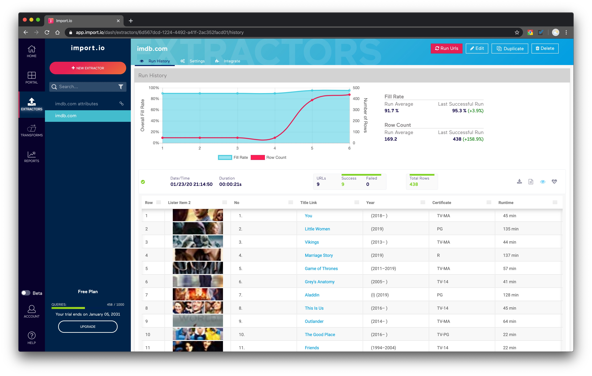
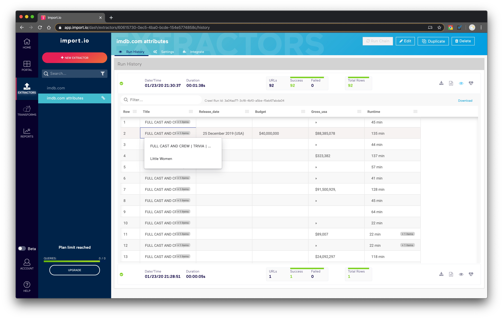

# INF 558: Building Knowledge Graphs
## Report of Homework1: Crawling
### Author: Zongdi Xu (USC ID 5900-5757-70)
### Date: Jan 23, 2020

### Task 1.3
- 1.3.1 What is the seed URL(s) you used for each task?

    > https://www.imdb.com/search/title/?genres=sci-fi  
    > https://www.imdb.com/search/name/?death_date=1990-01-01,&gender=male,female

- 1.3.2 How did you manage to only collect movie/show or cast pages?

    > For Task 1.1, the starting URL simply excludes those that are not movies or shows.  For Task 1.2, the program would not follow those cast pages links that appear to be not actors or actresses from the list.

- 1.3.3 Did you need to discard irrelevant pages? If so, how?

    > No need to discard irrelevant pages.

- 1.3.4 Did you collect the required number of pages? If you were not able to do so, please describe and explain your issues.

    > Yes.

### Task 2

2 chained extractors are used here.

- Extractor 1

    > Input: List of seed URLs  
    > Output: URLs of Romance movies/shows pages  
    > Role: Crawling every movie/show link from the lists of search pages  
    > Screenshot:  
    

- Extractor 2

    > Input: URLs of Romance movies/shows pages  
    > Output: Movie/show attributes in CSV format  
    > Role: Crawling attributes from every specific movie/show page  
    > Screenshot:  
    