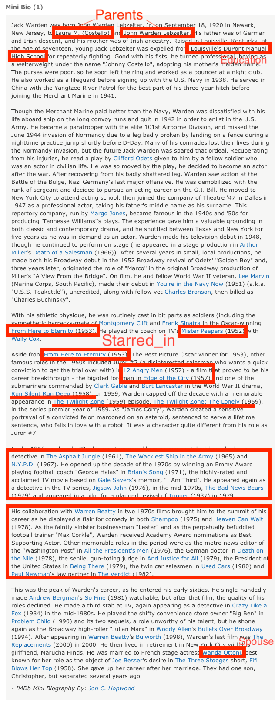

# INF 558: Building Knowledge Graphs
## Report of Homework2: Information Extraction
### Author: Zongdi Xu (USC ID 5900-5757-70)
### Date: Jan 30, 2020

### Task 2.1

From the page of [Jack Warden](https://www.imdb.com/name/nm0912001/bio?ref_=nm_ov_bio_sm), the attributes extracted from that biography text are showed as below:


Pick the sentence `He played the coach on TV's Mister Peepers` for visualization:


```python
# !python3 -m spacy download en_core_web_sm
import spacy
import en_core_web_sm
import csv
nlp = en_core_web_sm.load()
```


```python
sentence = nlp("He played the coach on TV's Mister Peepers")

from spacy import displacy
options = {"distance": 96}
displacy.render(sentence, style="dep", options=options)
```


<svg xmlns="http://www.w3.org/2000/svg" xmlns:xlink="http://www.w3.org/1999/xlink" xml:lang="en" id="8b9c790960414c2b8447c791aa371f70-0" class="displacy" width="914" height="329.0" direction="ltr" style="max-width: none; height: 329.0px; color: #000000; background: #ffffff; font-family: Arial; direction: ltr">
<text class="displacy-token" fill="currentColor" text-anchor="middle" y="239.0">
    <tspan class="displacy-word" fill="currentColor" x="50">He</tspan>
    <tspan class="displacy-tag" dy="2em" fill="currentColor" x="50">PRON</tspan>
</text>

<text class="displacy-token" fill="currentColor" text-anchor="middle" y="239.0">
    <tspan class="displacy-word" fill="currentColor" x="146">played</tspan>
    <tspan class="displacy-tag" dy="2em" fill="currentColor" x="146">VERB</tspan>
</text>

<text class="displacy-token" fill="currentColor" text-anchor="middle" y="239.0">
    <tspan class="displacy-word" fill="currentColor" x="242">the</tspan>
    <tspan class="displacy-tag" dy="2em" fill="currentColor" x="242">DET</tspan>
</text>

<text class="displacy-token" fill="currentColor" text-anchor="middle" y="239.0">
    <tspan class="displacy-word" fill="currentColor" x="338">coach</tspan>
    <tspan class="displacy-tag" dy="2em" fill="currentColor" x="338">NOUN</tspan>
</text>

<text class="displacy-token" fill="currentColor" text-anchor="middle" y="239.0">
    <tspan class="displacy-word" fill="currentColor" x="434">on</tspan>
    <tspan class="displacy-tag" dy="2em" fill="currentColor" x="434">ADP</tspan>
</text>

<text class="displacy-token" fill="currentColor" text-anchor="middle" y="239.0">
    <tspan class="displacy-word" fill="currentColor" x="530">TV</tspan>
    <tspan class="displacy-tag" dy="2em" fill="currentColor" x="530">NOUN</tspan>
</text>

<text class="displacy-token" fill="currentColor" text-anchor="middle" y="239.0">
    <tspan class="displacy-word" fill="currentColor" x="626">'s</tspan>
    <tspan class="displacy-tag" dy="2em" fill="currentColor" x="626">PART</tspan>
</text>

<text class="displacy-token" fill="currentColor" text-anchor="middle" y="239.0">
    <tspan class="displacy-word" fill="currentColor" x="722">Mister</tspan>
    <tspan class="displacy-tag" dy="2em" fill="currentColor" x="722">PROPN</tspan>
</text>

<text class="displacy-token" fill="currentColor" text-anchor="middle" y="239.0">
    <tspan class="displacy-word" fill="currentColor" x="818">Peepers</tspan>
    <tspan class="displacy-tag" dy="2em" fill="currentColor" x="818">PROPN</tspan>
</text>

<g class="displacy-arrow">
    <path class="displacy-arc" id="arrow-8b9c790960414c2b8447c791aa371f70-0-0" stroke-width="2px" d="M70,194.0 C70,146.0 131.0,146.0 131.0,194.0" fill="none" stroke="currentColor"/>
    <text dy="1.25em" style="font-size: 0.8em; letter-spacing: 1px">
        <textPath xlink:href="#arrow-8b9c790960414c2b8447c791aa371f70-0-0" class="displacy-label" startOffset="50%" side="left" fill="currentColor" text-anchor="middle">nsubj</textPath>
    </text>
    <path class="displacy-arrowhead" d="M70,196.0 L62,184.0 78,184.0" fill="currentColor"/>
</g>

<g class="displacy-arrow">
    <path class="displacy-arc" id="arrow-8b9c790960414c2b8447c791aa371f70-0-1" stroke-width="2px" d="M262,194.0 C262,146.0 323.0,146.0 323.0,194.0" fill="none" stroke="currentColor"/>
    <text dy="1.25em" style="font-size: 0.8em; letter-spacing: 1px">
        <textPath xlink:href="#arrow-8b9c790960414c2b8447c791aa371f70-0-1" class="displacy-label" startOffset="50%" side="left" fill="currentColor" text-anchor="middle">det</textPath>
    </text>
    <path class="displacy-arrowhead" d="M262,196.0 L254,184.0 270,184.0" fill="currentColor"/>
</g>

<g class="displacy-arrow">
    <path class="displacy-arc" id="arrow-8b9c790960414c2b8447c791aa371f70-0-2" stroke-width="2px" d="M166,194.0 C166,98.0 328.0,98.0 328.0,194.0" fill="none" stroke="currentColor"/>
    <text dy="1.25em" style="font-size: 0.8em; letter-spacing: 1px">
        <textPath xlink:href="#arrow-8b9c790960414c2b8447c791aa371f70-0-2" class="displacy-label" startOffset="50%" side="left" fill="currentColor" text-anchor="middle">dobj</textPath>
    </text>
    <path class="displacy-arrowhead" d="M328.0,196.0 L336.0,184.0 320.0,184.0" fill="currentColor"/>
</g>

<g class="displacy-arrow">
    <path class="displacy-arc" id="arrow-8b9c790960414c2b8447c791aa371f70-0-3" stroke-width="2px" d="M358,194.0 C358,146.0 419.0,146.0 419.0,194.0" fill="none" stroke="currentColor"/>
    <text dy="1.25em" style="font-size: 0.8em; letter-spacing: 1px">
        <textPath xlink:href="#arrow-8b9c790960414c2b8447c791aa371f70-0-3" class="displacy-label" startOffset="50%" side="left" fill="currentColor" text-anchor="middle">prep</textPath>
    </text>
    <path class="displacy-arrowhead" d="M419.0,196.0 L427.0,184.0 411.0,184.0" fill="currentColor"/>
</g>

<g class="displacy-arrow">
    <path class="displacy-arc" id="arrow-8b9c790960414c2b8447c791aa371f70-0-4" stroke-width="2px" d="M550,194.0 C550,50.0 813.0,50.0 813.0,194.0" fill="none" stroke="currentColor"/>
    <text dy="1.25em" style="font-size: 0.8em; letter-spacing: 1px">
        <textPath xlink:href="#arrow-8b9c790960414c2b8447c791aa371f70-0-4" class="displacy-label" startOffset="50%" side="left" fill="currentColor" text-anchor="middle">poss</textPath>
    </text>
    <path class="displacy-arrowhead" d="M550,196.0 L542,184.0 558,184.0" fill="currentColor"/>
</g>

<g class="displacy-arrow">
    <path class="displacy-arc" id="arrow-8b9c790960414c2b8447c791aa371f70-0-5" stroke-width="2px" d="M550,194.0 C550,146.0 611.0,146.0 611.0,194.0" fill="none" stroke="currentColor"/>
    <text dy="1.25em" style="font-size: 0.8em; letter-spacing: 1px">
        <textPath xlink:href="#arrow-8b9c790960414c2b8447c791aa371f70-0-5" class="displacy-label" startOffset="50%" side="left" fill="currentColor" text-anchor="middle">case</textPath>
    </text>
    <path class="displacy-arrowhead" d="M611.0,196.0 L619.0,184.0 603.0,184.0" fill="currentColor"/>
</g>

<g class="displacy-arrow">
    <path class="displacy-arc" id="arrow-8b9c790960414c2b8447c791aa371f70-0-6" stroke-width="2px" d="M742,194.0 C742,146.0 803.0,146.0 803.0,194.0" fill="none" stroke="currentColor"/>
    <text dy="1.25em" style="font-size: 0.8em; letter-spacing: 1px">
        <textPath xlink:href="#arrow-8b9c790960414c2b8447c791aa371f70-0-6" class="displacy-label" startOffset="50%" side="left" fill="currentColor" text-anchor="middle">compound</textPath>
    </text>
    <path class="displacy-arrowhead" d="M742,196.0 L734,184.0 750,184.0" fill="currentColor"/>
</g>

<g class="displacy-arrow">
    <path class="displacy-arc" id="arrow-8b9c790960414c2b8447c791aa371f70-0-7" stroke-width="2px" d="M454,194.0 C454,2.0 818.0,2.0 818.0,194.0" fill="none" stroke="currentColor"/>
    <text dy="1.25em" style="font-size: 0.8em; letter-spacing: 1px">
        <textPath xlink:href="#arrow-8b9c790960414c2b8447c791aa371f70-0-7" class="displacy-label" startOffset="50%" side="left" fill="currentColor" text-anchor="middle">pobj</textPath>
    </text>
    <path class="displacy-arrowhead" d="M818.0,196.0 L826.0,184.0 810.0,184.0" fill="currentColor"/>
</g>
</svg>


### Task 2.2


The template to apply extrators to the original entries:


```python
import csv
from spacy.matcher import Matcher
tsv_reader = csv.reader(open('entities_bio.tsv'), delimiter='\t')

limit = 500
count = 0

def matching(doc, pattern):
    result = []
    for sent in doc.sents:
        matcher = Matcher(nlp.vocab) 
        matcher.add("matching", None, pattern)  

        matches = matcher(nlp(str(sent))) 
        if len(matches)>0:
            match = matches[-1]
            span = sent[match[1]:match[2]] 
            result.append(span.text)

    return result

def max_length(list1, list2):
    if len(list1)>len(list2):
        return list1
    else:
        return list2

with open('cast.jl', 'w') as fout:
    for (idx, (url, bio)) in enumerate(tsv_reader):
        count += 1
        result = {}
        result['url'] = url
        result['spouse'] = max_length(matching(nlp(bio), pattern_spouse_lexical), matching(nlp(bio), pattern_spouse_syntactic))
        result['education'] = max_length(matching(nlp(bio), pattern_education_lexical), matching(nlp(bio), pattern_spouse_syntactic))
        result['parent'] = max_length(matching(nlp(bio), pattern_parent_lexical), matching(nlp(bio), pattern_spouse_syntactic))
        result['starred_in'] = max_length(matching(nlp(bio), pattern_starred_in_lexical), matching(nlp(bio), pattern_spouse_syntactic))
#         for idx, sent in enumerate(nlp(bio).sents):
#             pass
        fout.write(str(result)+'\n')
        if count>=limit:
            break
        pass
    fout.close()
```

#### Lexical Extractors


```python
pattern_spouse_lexical = [
            {'LOWER': 'married'},
            {'OP': '*'},
            {'LOWER': 'to'},
            {'TEXT': {'REGEX': '\s*'}, 'OP': '*'},
            {'IS_PUNCT': True, 'OP': '*'},
            {'TEXT': {'REGEX': '\s*'}, 'OP': '+'},
            ]
```


```python
pattern_parent_lexical = [
            {'LOWER': 'born'},
            {'OP': '*'},
            {'LOWER': 'to'},
            {'TEXT': {'REGEX': '\s*'}, 'OP': '*'},
            {'IS_PUNCT': True, 'OP': '*'},
            {'TEXT': {'REGEX': '\s*'}, 'OP': '+'},
            {'IS_PUNCT': True, 'OP': '*'},
            {'LOWER': 'and','OP': '?'},
            {'TEXT': {'REGEX': '\s*'}, 'OP': '*'},
            {'IS_PUNCT': True, 'OP': '*'},
            {'TEXT': {'REGEX': '\s*'}, 'OP': '+'},
            {'IS_PUNCT': True, 'OP': '*'},
            ]
```


```python
pattern_education_lexical = [
            {'TEXT': {'REGEX': '^(attend|attended)$'}},
            {'OP': '+'},
            ]
```


```python
pattern_starred_in_lexical = [
            {'TEXT': {'REGEX': '^(star|starred)$'}},
            {'LOWER': 'in'},
            {'OP': '+'},
            ]
```

#### Syntactic Extractors


```python
# define the pattern 
pattern_spouse_syntactic = [
            {'POS': 'ADJ', 'LOWER': 'married'},
            {'OP': '*'},
            {'LOWER': 'to', 'POS': 'ADP'},
            {'POS': 'ADJ', 'OP': '*'},
            {'POS': 'NOUN', 'OP': '*'},
            {'IS_PUNCT': True, 'OP': '*'},
            {'ENT_TYPE': 'PERSON', 'OP': '+'},
            ]
```


```python
pattern_parent_syntactic = [
            {'POS': 'VERB', 'ORTH': 'born'},
            {'OP': '*'},
            {'LOWER': 'to', 'POS': 'ADP'},
            {'POS': 'ADJ', 'OP': '*'},
            {'POS': 'NOUN', 'OP': '*'},
            {'IS_PUNCT': True, 'OP': '*'},
            {'ENT_TYPE': 'PERSON', 'OP': '+'},
            {'IS_PUNCT': True, 'OP': '*'},
            {'LOWER': 'and', 'POS': 'CCONJ', 'OP': '?'},
            {'POS': 'ADJ', 'OP': '*'},
            {'POS': 'NOUN', 'OP': '*'},
            {'IS_PUNCT': True, 'OP': '*'},
            {'ENT_TYPE': 'PERSON', 'OP': '+'},
            {'IS_PUNCT': True, 'OP': '*'},
            ]
```


```python
pattern_education_syntactic = [
            {'POS': 'VERB', 'LEMMA': 'attend'},
            {'OP': '+'},
            ]
```


```python
pattern_starred_in_syntactic = [
            {'POS': 'VERB', 'LEMMA': 'star'},
            {'POS': 'ADP', 'LOWER': 'in'},
            {'OP': '+'},
            ]

```

### Task 2.3

Recall rates for every extractor:

|Attribute|spouse|education|parent|starred_in|
|---|---|---|---|---|
|Lexical|90%|80%|95%|70%|
|Syntactic|85%|85%|80%|70%|