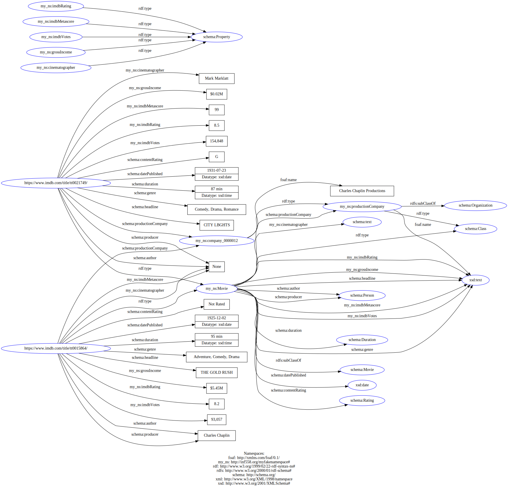

# INF 558: Building Knowledge Graphs
## Report of Homework3
## Entity Resolution & Knowledge Representation
### Author: Zongdi Xu (USC ID 5900-5757-70)
### Date: Feb 9, 2020

### Task 1.1

#### Similarity methods for `movie title / name`

According to the analysis, the cases are quite complicated.  Some names have typos inside them.  Some match in a few leading or ending characters (refer to similarity function 1 & 2). Others might be made out of the same series of words but appear to be in different orders (refer to similarity function 3 & 4).

The choice is a combination of both Jaro and Levenshtein Similarity.

```python
# calculate the Jaro Similarity of the leading 8 characters of both names (the entire names instead if the length<8)
def name_string_similarity_1(r_imdb, r_afi):
    s1 = r_imdb.name_string.lower()[:8]
    s2 = r_afi.name_string.lower()[:8]

    return rltk.jaro_winkler_similarity(s1, s2)
```
```python
# calculate the Levenshtein Similarity of the ending 8 characters of both names (the entire names instead if the length<8)
def name_string_similarity_2(r_imdb, r_afi):
    s1 = r_imdb.name_string.lower()[-8:]
    s2 = r_afi.name_string.lower()[-8:] 

    return rltk.levenshtein_similarity(s1, s2)
```
```python
# split the names into words, re-concatenate them together in lexicographical order and calculate the Jaro Similarity
def name_string_similarity_3(r_imdb, r_afi):
    s1 = ''.join(sorted(re.split(r'[-,\s]+', r_imdb.name_string.lower())))
    s2 = ''.join(sorted(re.split(r'[-,\s]+', r_afi.name_string.lower())))

    return rltk.jaro_winkler_similarity(s1, s2)
```
```python
# split the names into words, re-concatenate them together in lexicographical order and calculate the Levenshtein Similarity
def name_string_similarity_4(r_imdb, r_afi):
    s1 = ''.join(sorted(re.split(r'[-,\s]+', r_imdb.name_string.lower())))
    s2 = ''.join(sorted(re.split(r'[-,\s]+', r_afi.name_string.lower())))

    return rltk.levenshtein_similarity(s1, s2)
```

#### Similarity methods for `release year / date`

The case are less complicated because such values can be regarded as numerical values.  According to the analysis, both dates (or years) will be regarded as 100% similar if their difference is less than 2 years (taking possible typos and errors into consideration) or the either value is `null`, otherwise 0% similar.  Either value being `null` indicates something was missing, but these two movies might still match.

```python
year_1 = r_imdb.raw_object.get('year')
year_2 = re.search(r'[0-9]{4}', r_afi.raw_object.get('release_date', ''))
match_year = abs(int(year_1) - int(year_2[0])) <= 2 \
    if year_1 is not None and year_2 is not None \
    else True

match_year
```

#### Similarity methods for `genre`

Such values can be converted into sets of words.  Both sets are 100% similar when they have intersection or the either value is `null`.  Either value being `null` indicates something was missing, but these two movies might still match.

```python
genre_1 = set(word[:3] for word in re.split(r'[-,\s]+', r_imdb.raw_object.get('genre', '').lower().strip()))
genre_2 = set(word[:3] for word in re.split(r'[-,\s]+', r_afi.raw_object.get('genre', '').lower().strip()))

match_genre = len(genre_1 & genre_2) > 0 \
    if genre_1 is not None and genre_2 is not None else True

match_genre
```
### Task 1.2

The combination of all the scores of names above:
```python
score_1 = name_string_similarity_1(r_imdb, r_afi)
score_2 = name_string_similarity_2(r_imdb, r_afi)
score_3 = name_string_similarity_3(r_imdb, r_afi)
score_4 = name_string_similarity_4(r_imdb, r_afi)

# if the both name are exactly the same, their combined score will be fixed at 1.1; otherwise combine the scores proportionally
score = 1.1 if name_1 == name_2 \
        else 0.1 * score_1 + 0.15 * score_2 + 0.45 * score_3 + 0.4 * score_4

score > 1.0
```

The algorithm of combining the scores from all the attributes and determine whether both movies match or not:

- Step 1: If both movies have similar release dates / years (`match_year == True`), output this pair of movies as a possible match with their combined name `score` and jump to Step 4; otherwise continue to Step 2.
- Step 2: If both movies have similar genres (`match_genre == True`), continue to Step 3; otherwise disgard this pair of movies and jump to Step 4.
- Step 3: If both movies have the exact same name (name scores `> 1.0`), output this pair of movies as a possible match with their combined name `score` and continue to Step 4; otherwise disgard this pair of movies since they are dissimilar.
- Step 4: Repeat Step 1~3 to get the scores of every possible matches, of which one from IMDB and the other one from AFI.
- Step 5: Finally, pick up one possible match with the highest combined name score, which turns out to be the most likely match.
  
```python
# entity linkage scoring function
def rule_based_method(r_imdb, r_afi):
    # calculate score, match_year & match_genre as described before
    # ...

    # the algorithm to combine all scores
    return match_year or match_genre and score > 1.0, score

# threshold value to determine if we are confident about the  match
MY_TRESH = 0.8

valid_match = []
# nested loop in search of matches
for r_imdb in ds_imdb:
    # test this record with AFI records
    optimum = (None, MY_TRESH)
    for r_afi in ds_afi:
        result, confidence = rule_based_method(r_imdb, r_afi)
        if result and confidence > optimum[1]:
            # replace by another match of a higher combined name score
            optimum = (r_afi, confidence)

    if optimum[0] is not None: # find at least one local optimal match
        r_afi, confidence = optimum
        valid_match.append(
            {'imdb_movie': r_imdb.raw_object['url'], 'afi_movie': r_afi.raw_object['url']})
    else: # no match
        valid_match.append(
            {'imdb_movie': r_imdb.raw_object['url'], 'afi_movie': None})

valid_match
```

### Task 2.1
The properties of describing `imdb-rating`, `imdb-metascore`, `imdb-votes`, `gross-income` and `cinematographer` attributes can't be found from `schema.org`.
```
my_ns:imdbRating a schema:Property .

my_ns:imdbMetascore a schema:Property .

my_ns:imdbVotes a schema:Property .

my_ns:grossIncome a schema:Property .

my_ns:cinematographer a schema:Property .
```

Production Company Class:
```
my_ns:productionCompany a schema:Class ;
    rdfs:subClassOf schema:Organization ;
    foaf:name xsd:text .
```

Movie Class:
```
my_ns:Movie a schema:Class ;
    rdfs:subClassOf schema:Movie ;
    # TODO: complete the rest of the missing attributes
    schema:headline xsd:text ; # title
    schema:datePublished xsd:date ; # release-date
    schema:contentRating schema:Rating ; # certificate
    schema:duration schema:Duration ; # runtime
    schema:genre xsd:text ; # genre
    my_ns:imdbRating xsd:text ; # imdb-rating
    my_ns:imdbMetascore xsd:text ; # imdb-metascore
    my_ns:imdbVotes xsd:text ; # imdb-votes
    my_ns:grossIncome xsd:text ; # gross-income
    schema:producer schema:Person ; # producer
    schema:author schema:Person ; # writer
    my_ns:cinematographer schema:text ; # cinematographer
    schema:productionCompany my_ns:productionCompany . # production-company
```

### Task 2.3

The graph visualization:
